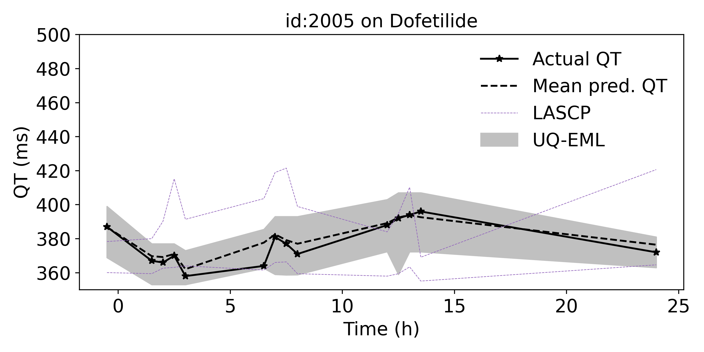
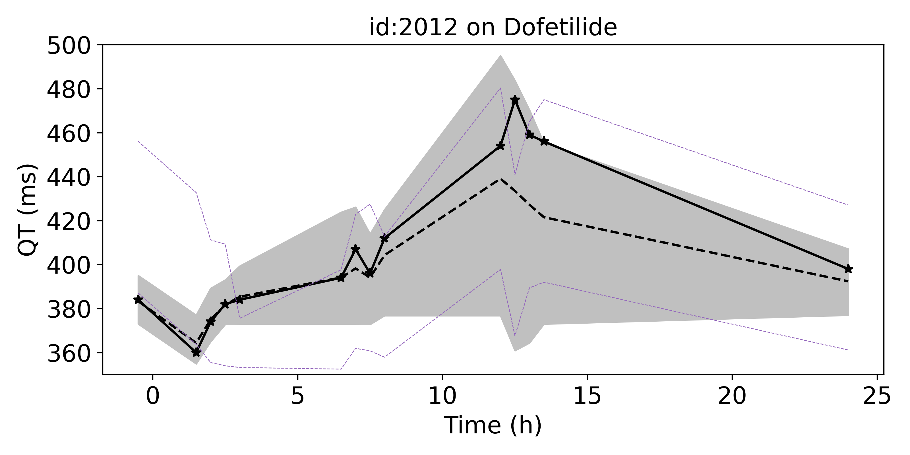

# UNCERTAINTY QUANTIFICATION FOR QT INTERVAL MEASUREMENTS USING ENSEMBLES OF DEEP MODELS AND ELECTROCARDIOGRAPHIC LEADS

Python (3.8.0) implementation of the UQ-EML and LASCP methods. The packages required can be found in `requirements.txt` 

 