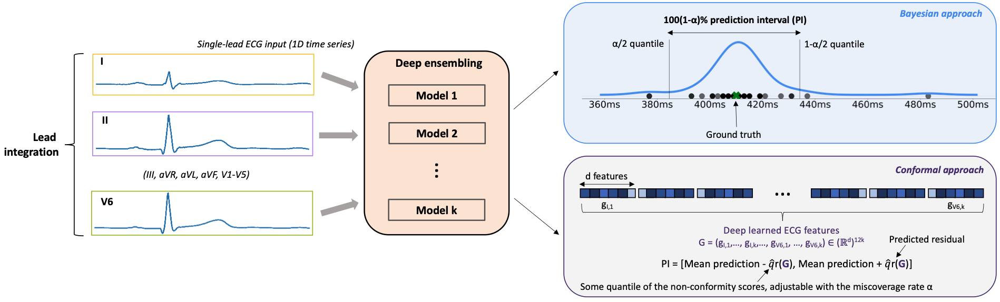

Python (3.8.0) implementation of the UQ-EL, UQ-ELM (approximate Bayesian inference) and LASCP (conformal prediction) methods. Run `sh commands.sh` to setup a virtual environment and evaluate the 3 methods.

 
 